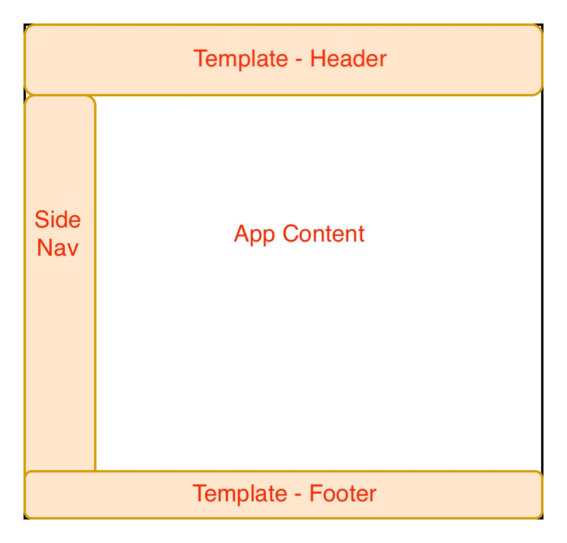

# Micro-Frontend Module Federation

Experiment to determine if Vite's Module Federation can be used in conjunction with NextJS Module Federation.

## Intro

Micro-frontend is an architectural approach that breaks down a large, monolithic frontend application into smaller, self-contained, and independently deployable micro-applications. For example, an e-commerce website might be divided into domains such as products, orders, payments, and users, each handled by separate micro-frontends.

To ensure consistency across all micro-frontends, shared components like templates are created. A template component might contain Header, Footer, Size-Nav and Authentication.



There are several methods to distribute these shared components:

- Build-time integration: Components are included during the build process.
- Runtime integration: Components are loaded dynamically at runtime.
- CMS: A content management system is used to manage and deliver shared components.

#### Build-time Integration

Build-time integration is ideal for smaller-sized applications with a limited number of micro-frontends. In this approach, shared components are distributed as NPM packages, which each micro-frontend consumes as a dependency. However, this method requires all micro-frontends to update to the exact same version of the shared components, necessitating simultaneous deployment of all applications whenever updates are made.

This method requires better coordination and collaboration among teams. Any changes required to rebuild and redeploy the whole application

#### CMS

Content Management Systems (CMS) like Adobe AEM, Drupal, or Laravel are well-suited for larger applications with hundreds of pages (micro-frontends). They help manage and deliver shared components efficiently across numerous micro-frontends.

#### Runtime Integration

Runtime integration is ideal for medium-sized applications with around 10 to 15 micro-frontends, especially when avoiding the cost of a CMS license. In this approach, shared templates are hosted as a separate remote application, and each micro-frontend loads the remote template at runtime. Any changes made to the shared templates or components are reflected immediately in production without requiring redeployment of the other micro-frontend applications.

Tooling and initial setup could be complicated.

## Module Federation

Module Federation is a technique for runtime code sharing, where modules (remote components) are dynamically integrated into a container application (micro-frontend) at runtime. Changes to the remote components are immediately reflected in production once deployed.

This example aims to test whether Vite Module Federation (using Rollup) can be used to build shared templates or components that can be consumed by NextJS micro-frontend applications (using Webpack).

This example includes the following remote components:

- AuthenticatedTemplate
- UnauthenticatedTemplate

The micro-frontend applications involved are:

- Home App (NextJS)
- Dashboard App (Vite)
- Messages App (NextJS)
- Settings App (NextJS)

## Lesson learnt / Challenges

- Typescript. Unable to determine the types of shared components as they are loaded at runtime.
- Zustand not working. Any package that uses `use-sync-external-store`, will not work.
  https://github.com/pmndrs/zustand/discussions/1881
- State sharing between remote components and micro-frontends, such as hooks or contexts, is not possible due to the use of different build tools: remote apps are built with Vite (Rollup), while micro-frontends use NextJS (Webpack). To enable state sharing, remote apps would need to be built with Webpack as well.
  E.g. webpack-to-webpack https://github.com/kevinuehara/microfrontends-module-federation/tree/main
- Server side rendering setup could be complex (Didn't try)
- Multiple versions of React may be loaded if there's a version mismatch between remote components and micro-frontends, making version management more challenging.
- Vite Apps with basePath is not working with module federation
  https://github.com/originjs/vite-plugin-federation/issues/580

## Running Example App

This example app is set up as a monorepo using NX, `npm add --global nx@latest` source: https://nx.dev/getting-started/installation. Ideally each micro-frontend would have its own repository.

**console 1**
I used nodejs version 20.x

```shell
npm install

nx build  shared-app
nx preview  shared-app
```

**console 2**

```shell
[Copy the command below and paste it in the console]
NEXT_PRIVATE_LOCAL_WEBPACK=true nx run-many --target=dev --projects=home-app,dashboard-vite-app,messages-app,settings-app
```

**console 3**
This is OPTIONAL. Sometimes NX is unable to start all the apps simultaneously.
Even if it fails to start, it might not be required to run this app.

```shell
nx dev settings-app
nx preview  shared-app
```
